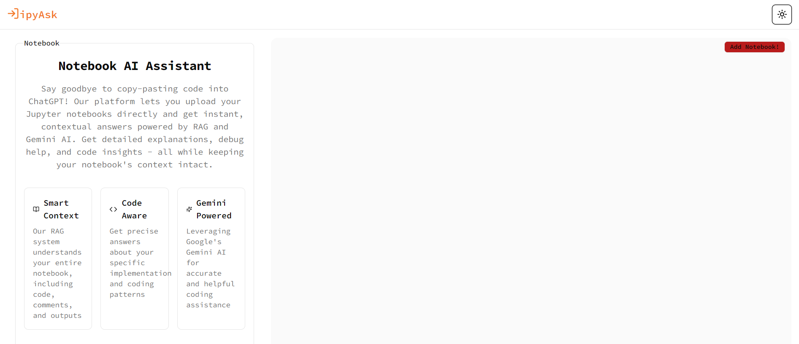

# IPyAsk - Your Jupyter Notebook AI Assistant

IPyAsk is an innovative tool that helps users interact with their Jupyter notebooks using AI. Say goodbye to copy-pasting code into ChatGPT! IPyAsk allows you to upload your `.ipynb` files and ask contextual questions directly from your notebook, getting instant and accurate answers with the help of RAG (Retrieval-Augmented Generation) and Gemini AI.




## Features

- **Smart Context Understanding**: IPyAsk comprehends your entire notebook, including code, comments, and outputs to give highly contextual answers.
- **Code-Aware Responses**: Get precise answers based on your specific implementation and coding patterns.
- **Gemini-Powered AI**: Leverage Google’s Gemini AI to assist with debugging, explaining code, and generating insights, while keeping your notebook context intact.
- **Notebook Upload and Query**: Users can upload their Jupyter notebooks and get answers to their queries.
- **RAG System**: Retrieves relevant content from the uploaded notebook to generate accurate responses.
- **Vector Store Integration**: Ensures fast and context-aware retrieval from the notebook data.
- **Next.js Frontend**: Provides an interactive and responsive user interface.
- **Streaming AI Responses**: Powered by Vercel AI SDK for seamless conversation flow.

## How It Works

1. **Upload your Python notebook (.ipynb file)**: Start by uploading your Jupyter notebook.
2. **Wait for the magic to work ✨**: Our system processes your notebook.
3. **Ask questions**: Query anything related to your notebook, and IPyAsk will provide instant answers with full context from your code.


## Pro Tip

Add detailed markdown cells and code comments in your notebook for even more accurate and context-aware responses!

## Project Architecture

IPyAsk works by utilizing a two-step process:

1. **Notebook Processing**:
   - The uploaded notebook is encoded into a base64 string and sent to the API endpoint `/api/extractnotebookgemini`.
   - The base64 string is decoded, and the notebook content is split into manageable chunks.
   - These chunks are embedded using the **Gemini Text Embedding 004** model, and a unique namespace is created and stored in the **Pinecone vector store**.

2. **Question Processing**:
   - When a user asks a question, it is sent to the `/api/notebookchat` endpoint.
   - The query is embedded, and the top 5 relevant contexts are retrieved from **Pinecone**.
   - Using the **Gemini 1.5 Pro** model and **Vercel AI SDK**, the response is generated and streamed back to the user.


## Live Demo

Experience IPyAsk in action: [https://ipy-ask.vercel.app/](https://ipy-ask.vercel.app/)

## Tech Stack

IPyAsk leverages the following technologies:

- **Next.js**
- **Vercel AI SDK**
- **LangChain**
- **Gemini Embeddings**
- **Pinecone Vector Store**

## Getting Started

### Prerequisites

- Node.js and npm
- Git

### Installation

1. **Clone the repository**:

   ```bash
   git clone https://github.com/Keerthan04/IpyAsk.git
   cd ipyask
   ```

2. **Install dependencies**:

   ```bash
   npm install
   ```

3. **Set up credentials**:

   To access the vector store, make sure you have the appropriate API keys. Please contact the repository owner for more details.

4. **Start the development server**:

   ```bash
   npm run dev
   ```

5. **Open the application**:

   Go to [http://localhost:3000](http://localhost:3000) in your browser.

## Usage

1. **Upload your notebook** using the upload interface.

2. **Ask your question** related to the notebook’s content.

3. **Review the AI-generated answer** based on the relevant notebook sections.

## Contributing

IPyAsk is still in its early development phase, and this is just the first test version. We welcome all feedback to help improve and shape the project! Feel free to test it, report any issues, and suggest or implement fixes.

Whether you're contributing bug fixes, adding new features, or enhancing the documentation, your contributions are valuable. Please submit pull requests or open issues, and let’s work together to make IPyAsk even better!

## Contact

For any inquiries, you can reach out at:

- **GitHub**: [Keerthan04](https://github.com/Keerthan04)
- **Email**: [ckeerthankumar4@gmail.com](mailto:ckeerthankumar4@gmail.com)

## Acknowledgments

- **Jupyter Project**
- **Vercel** for hosting and AI SDK
- **Pinecone** for vector storage
- **All contributors and users**

Thank you for checking out IPyAsk! I hope this tool enhances your Jupyter Notebook experience.
